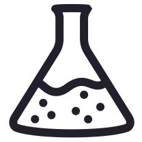

<div align="center">
    
    <h3>Medchem - Molecular filtering for drug discovery</h3>
</div>

---

[](https://pypi.org/project/medchem/)
[](https://anaconda.org/conda-forge/medchem)
[](https://pypi.org/project/medchem/)
[](https://anaconda.org/conda-forge/medchem)
[](https://pypi.org/project/medchem/)
[](https://github.com/datamol-io/medchem/blob/main/LICENSE.md)
[](https://github.com/datamol-io/medchem/stargazers)
[](https://github.com/datamol-io/medchem/network/members)
[](https://github.com/datamol-io/medchem/actions/workflows/test.yml)
[](https://github.com/datamol-io/medchem/actions/workflows/release.yml)
[](https://github.com/datamol-io/medchem/actions/workflows/code-check.yml)
[](https://github.com/datamol-io/medchem/actions/workflows/doc.yml)

Medchem is a Python library that proposes multiple molecular medchem filters to a wide range of use cases relevant in a drug discovery context.

## Installation

```bash
micromamba install -c conda-forge medchem

# or using pip
pip install medchem
```

## Documentation

Visit <https://medchem-docs.datamol.io/>.

## Development lifecycle

### Setup dev environment

```bash
micromamba create -n medchem -f env.yml
micromamba activate medchem

pip install --no-deps -e .
```

### Tests

You can run tests locally with:

```bash
pytest
```

## License

Under the Apache-2.0 license. See [LICENSE.md](LICENSE.md).
